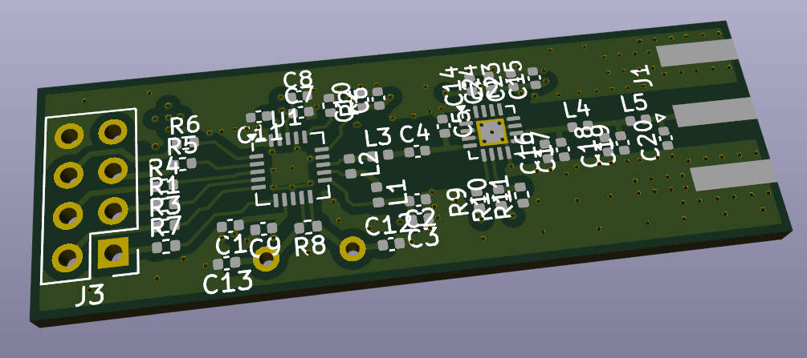
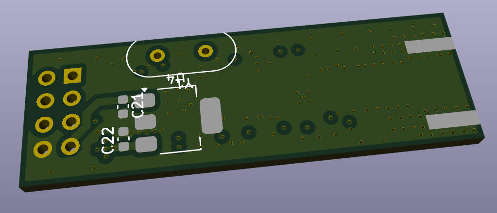

# Radio board with Power Amplifier.

A 2.4GHz generic radio communication board based on NRF24L01+ Nordic radio chip and RFX2101C Power Amplifier chip.

It is equipped with an on-board 3.3V linear regulator. So, it hasn't ever been noticed loosing a connection or malfunctioning due to power rail voltage fluctuations if powered with anything above 3.7V.

Thermal design turned out to be good. At max power and constant carrier mode the board consumes ~200mA of current. But neither part gets hot. The whole board heats up evenly and is just warm on touch.

